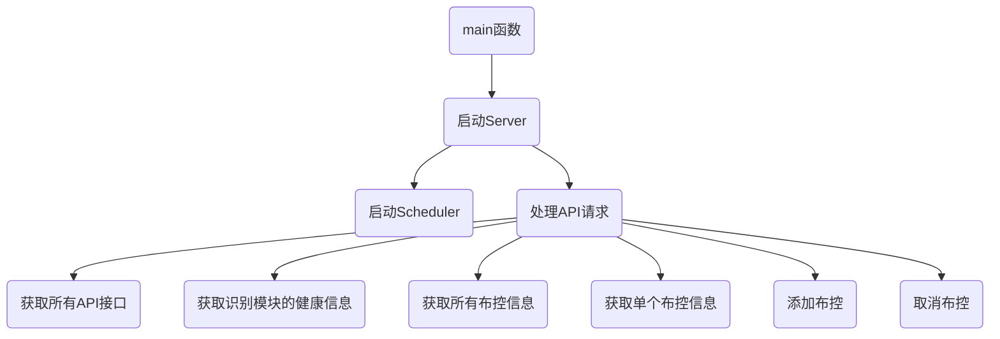

Analyzer

#### 介绍
视频流实时分析器v2.0.0

支持YOLOv8版本的TensorRt模型，ONNX模型，OpenVINO模型，其中ONNX模型支持CPU、CUDA加速，OpenVINO支持CPU和GPU，新增模型的自定义输出，模型的自定义标签，报警自定义类别（报警类别需要在识别类别中），支持全局异常处理，不用在为不知道什么原因导致程序崩溃而烦恼。

#### 编译
~~~
windows版支持 x64/Release,x64/Debug
linux
~~~

#### 第三方库

1.  ffmpeg
2.  curl
3.  event
4.  jpeg-turbo
5.  jsoncpp
6.  opencv
7.  openvino
8.  tensorrt
9.  cuda

